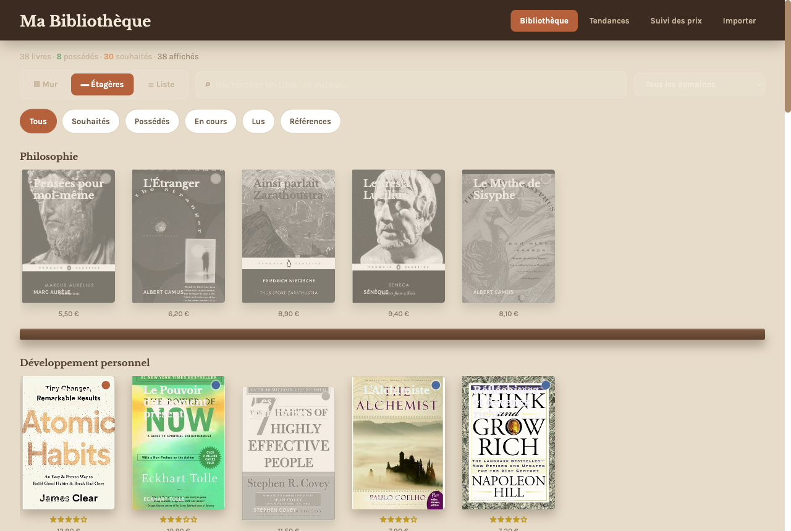
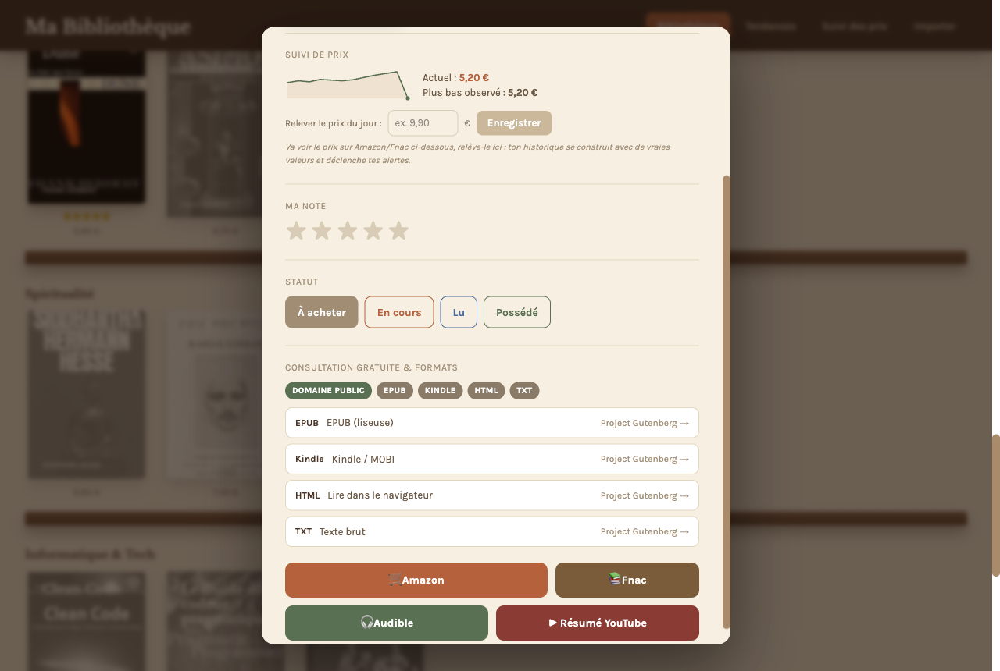
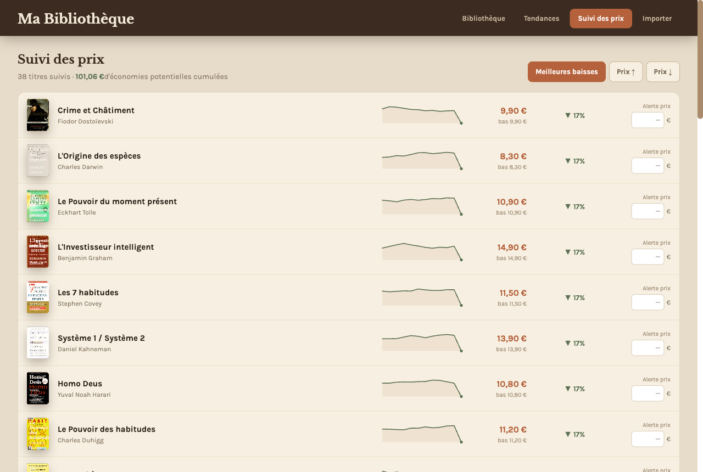
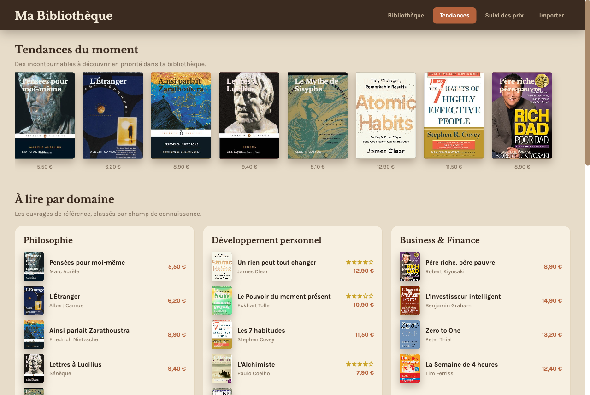
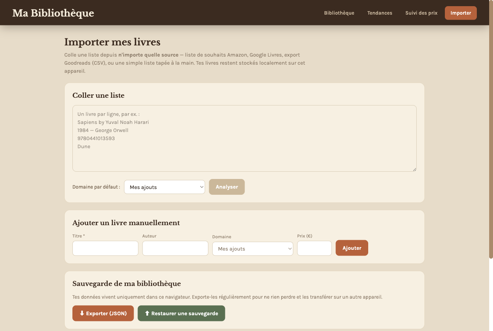

<div align="center">

# 📚 Ma Bibliothèque

**Ta bibliothèque de livres, en ligne.**
Souhaits · références par domaine · tendances · suivi des prix · disponibilité gratuite dans tous les formats.

[](https://ma-bibliotheque-pi.vercel.app)

[](https://nextjs.org)
[](https://react.dev)
[](https://www.typescriptlang.org)
[](#-tests)
[](https://ma-bibliotheque-pi.vercel.app)
[](LICENSE)

<br />



</div>

---

## ✨ Ce que ça fait

- 📖 **3 vues de bibliothèque** — **Mur**, **Étagères** (regroupées par domaine, façon bibliothèque physique) et **Liste**. Recherche plein texte + filtres par statut et par domaine.
- 💛 **Souhaits & possession** — statut par livre (*À acheter · En cours · Lu · Possédé*), note perso sur 5 étoiles, souhaits grisés sur le mur.
- 🧭 **Références à lire par domaine** — les incontournables classés par champ de connaissance (philosophie, business, science, psychologie, fiction, SF, spiritualité, tech…).
- 📈 **Suivi des prix** — historique par livre (sparkline), plus bas observé, meilleures baisses, **alertes de prix**. Tu **relèves un prix réel** depuis la fiche → l'historique se construit avec de vraies valeurs datées.
- 🆓 **Consultation gratuite & formats** — pour chaque livre, recherche en direct des versions libres et de leur format :
  - **Project Gutenberg** → EPUB · Kindle/MOBI · HTML · TXT (domaine public)
  - **Open Library / Internet Archive** → lecture en ligne ou emprunt gratuit
  - **LibriVox** → livres audio libres
  - sinon → liens d'achat (Amazon, Fnac), Audible et résumé YouTube
- 📥 **Import universel** — colle une liste depuis **Amazon**, **Google Livres**, un export **Goodreads (CSV)**, ou tape-la à la main. Un **ISBN seul suffit** (titre/auteur retrouvés automatiquement).
- 💾 **Sauvegarde** — exporte/restaure toute ta bibliothèque en JSON.

## 🖼️ Aperçu

| Consultation gratuite & tous formats | Suivi des prix + alertes |
|:---:|:---:|
|  |  |
| **Références à lire par domaine** | **Import universel de wishlist** |
|  |  |

## 🚀 Démo en ligne

👉 **[ma-bibliotheque-pi.vercel.app](https://ma-bibliotheque-pi.vercel.app)**

## 🛠️ Stack

| | |
|---|---|
| **Framework** | Next.js 16 (App Router) · React 19 · TypeScript |
| **Style** | Tailwind CSS 4 + styles inline (esthétique « bibliothèque ») |
| **Données** | `localStorage` — aucune base, aucun secret |
| **APIs publiques** | Open Library (couvertures + métadonnées), Gutendex (Gutenberg), LibriVox |
| **Tests** | Vitest |
| **Déploiement** | Vercel |

## ⚡ Installation

> Prérequis : **Node.js ≥ 20** et **npm**.

```bash
# 1. Cloner le dépôt
git clone https://github.com/hexapost-studio/ma-bibliotheque.git
cd ma-bibliotheque

# 2. Installer les dépendances
npm install

# 3. Lancer en développement
npm run dev
```

Ouvre **http://localhost:3000** 🎉

```bash
# Build de production
npm run build && npm run start

# Lancer les tests
npm test
```

## 📥 Importer ta bibliothèque

Va sur **/importer** et colle ta liste — un livre par ligne. Tous ces formats fonctionnent :

```
Sapiens by Yuval Noah Harari      ← style liste de souhaits Amazon
1984 — George Orwell              ← séparateur tiret
9780441013593                     ← ISBN seul (titre retrouvé automatiquement)
Le Comte de Monte-Cristo          ← titre simple
```

> **Exporter depuis…**
> **Amazon** : liste de souhaits → « … » → *Imprimer la liste* → copier les lignes.
> **Goodreads** : *My Books → Import and export → Export Library* (CSV) → coller le fichier.
> **Google Livres / autre** : copier les titres, un par ligne.

## 🔒 Confidentialité

- **Aucune donnée personnelle** dans le dépôt : ni compte, ni e-mail, ni identifiant de liste de souhaits.
- **Tout est stocké en local** dans ton navigateur (`localStorage`) — livres, statuts, notes, prix, alertes.
- Les seuls appels réseau sont des lectures d'**API publiques anonymes** (couvertures, métadonnées, disponibilité).
- Le catalogue de départ est un **exemple** générique, entièrement remplaçable par ta propre liste.

## 🧪 Tests

```bash
npm test
```

Vitest couvre le **parseur d'import** (`src/lib/import.ts`) et le **store local** (`src/lib/store.ts`) — 15 tests.

## ☁️ Déploiement

Déjà en ligne sur Vercel. Pour ton propre déploiement, deux options :

- **Git (recommandé)** — importe le repo sur [vercel.com/new](https://vercel.com/new) → Vercel redéploie à chaque `git push` (framework auto-détecté, **aucune variable d'environnement**).
- **CLI** — `npm i -g vercel` puis `vercel deploy --prod`.

## 🗺️ Roadmap

- [ ] Synchro multi-appareils (Supabase) → débloque le rafraîchissement automatique des prix
- [ ] PWA / mode hors-ligne
- [ ] Import direct par lien de wishlist

## 📄 Licence

[MIT](LICENSE) — libre d'utilisation, de modification et de partage.

---

<div align="center">
<sub>Bibliothèque personnelle open source · construite avec Next.js</sub>
</div>
